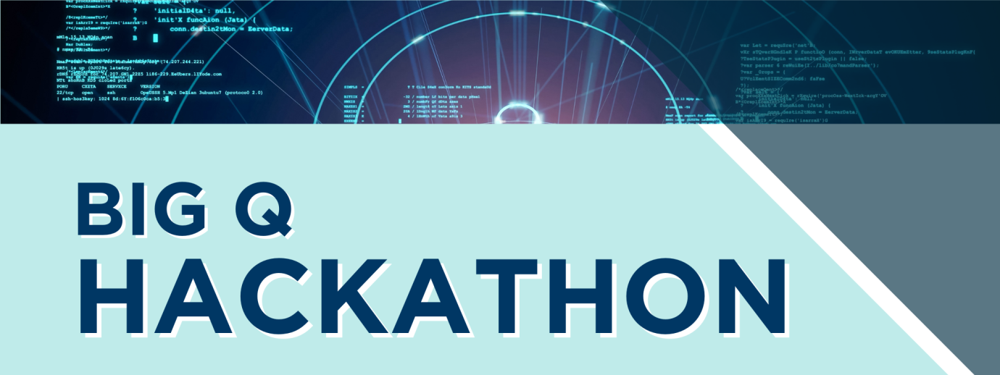

# BIG Q HACKATHON by CQE and QuantX
Dear participants, 

Welcome to the BIG Q HACKATHON! This README.md provides you with all the essential information you need to make the most of this exciting event.
The Chicago Quantum Exchange, in partnership with QuantX, will host the BIG Q Hackathon, a four-day quantum competition that will convene members of the entire quantum computing value chain, connecting industry and quantum computing platform providers with technical and business talent to collaborate on quantum solutions to real-world industry challenges.

QuantX has previously co-organized successful BIG Q Hackathons in Europe and Canada, generating productive discussions, creative solutions, and several new collaborations.  We are bringing this unique competition to the US for the first time.  

## GitHub Repository
You can find the computational challenge proposed by our industrial partner in our GitHub repository. [Link to GitHub](insert_link_here)

## Communication on Slack
We provide access to a dedicated Hackathon Slack channel for efficient communication and technical support. If you haven't received access, please contact [email address](mailto:alexandre@quantx.fr).

## Organization and agenda
This event occurs on September 29 - October 2, 2023 at <strong> 1871 Tech Incubator, 222 W Merchandise Mart Plaza #1212, Chicago, IL 60654 </strong>. This competition will have a unique format with a Technical Phase (Days 1 and 2) and a Business Phase (Days 3 and 4). We've partnered with leading companies and organizations to provide you with a unique opportunity to collaborate and address complex challenges. A cocktail will close the event on October 2nd.  

### 1. Technical phase (September 29-30, 2023 Chicago)

**Partners:**
Boeing, Capgemini, CSL, Johnson & Johnson Innovation, NCSA, Mayo Clinic, Skyway and United
 
 AWS, IBM, Pasqal, qBraid, Quantinuum, NVIDIA, Infleqtion, and QuEra.

| **Date**       | **Time**   | **Event**                                                           |
| -------------- | ---------- | ------------------------------------------------------------------- |
|  Sept.29      | 8:30 am    | Arrival and Breakfast                                               |
|                | 9:00 am    | Welcome Remarks, Introductions, and BIG Q Hackathon Overview        |
|                | 9:30 am    | Launch of the Technical Phase. Technical Teams move to break-out rooms with QC platform mentors and use case company mentors. Teamwork begins. |
|                | 11:00 am   | Coffee Break + Professional Speed Dating Session for invited guests. |
|                | 12:30 pm   | Lunch + Sponsor Spotlight [Johnson & Johnson Innovation]              |
|                | 3:30 pm    | Coffee Break                                                        |
|                | 6:30 pm    | End of Day 1. Front doors locked. Teams can continue working inside but cannot re-enter once they exit. |
| Sept.30        | 8:30 am    | Arrival and Breakfast                                               |
|                | 9:00 am    | Technical Teams continue teamwork.                                   |
|                | 11:00 am   | Coffee Break + Professional Speed Dating Session for invited guests. |
|                | 12:30 pm   | Lunch                                                               |
|                | 2:45 pm    | Technical Phase ends, collection of Technical Team presentations.    |
|                | 3:00 pm    | Technical Team presentations. Coffee and Snacks.                    |
|                | 5:30 pm    | Jury deliberation                                                   |
|                | 6:00 pm    | Technical Phase closing remarks. End of Day 2.                       |

### 2. Business phase (October 1-2, 2023 Chicago)

| **Date**       | **Time**   | **Event**                                                           |
| -------------- | ---------- | ------------------------------------------------------------------- |
|  Oct.1         | 8:30 am    | Arrival and Breakfast                                               |
|                | 9:00 am    | Launch of the Business Phase - Kick-Off and introduction            |
|                | 9:30 am    | Business Teams move to break-out rooms with QC platform mentors, use-case company mentors, and technical team reps. Teamwork begins. |
|                | 11:00 am   | Coffee Break + Professional Speed Dating Session for invited guests. |
|                | 12:30 pm   | Lunch + Sponsor Spotlight [Capgemini]                               |
|                | 3:30 pm    | Coffee Break                                                        |
|                | 6:30 pm    | End of Day 3. Front doors locked. Teams can continue working inside but cannot re-enter once they exit. |
|  Oct.2         | 8:30 am    | Arrival and Breakfast                                               |
|                | 9:00 am    | Business Teams continue teamwork.                                   |
|                | 11:00 am   | Coffee Break + Professional Speed Dating Session for invited guests. |
|                | 12:30 pm   | Lunch                                                               |
|                | 2:00 pm    | Business Phase ends, collection of Business Team presentations.     |
|                | 2:30 pm    | Business Team presentations. Coffee and Snacks.                     |
|                | 4:30 pm    | Jury deliberation                                                   |
|                | 5:00 pm    | End of Hackathon                                                    |
|                | 5:30 pm - 8:00 pm | Closing Reception and Award Ceremony                            |

## Awards Ceremony and Networking Cocktail
The event concludes with an Awards Ceremony and Networking Cocktail on October 2nd, 2023. It's a great opportunity to celebrate your achievements and network with fellow participants, partners, and invited guests. All the participants will have a unique opportunity to exchange with the providers on the career possibilities and potential to collaborate.
We look forward to an exciting and productive hackathon experience! If you have any specific needs or questions, please don't hesitate to reach out to us.

Good lucQ! 

Preeti Chalsani and Andrea Jett for CQE

Elvira, Elie and Alexandre, for QuantX
